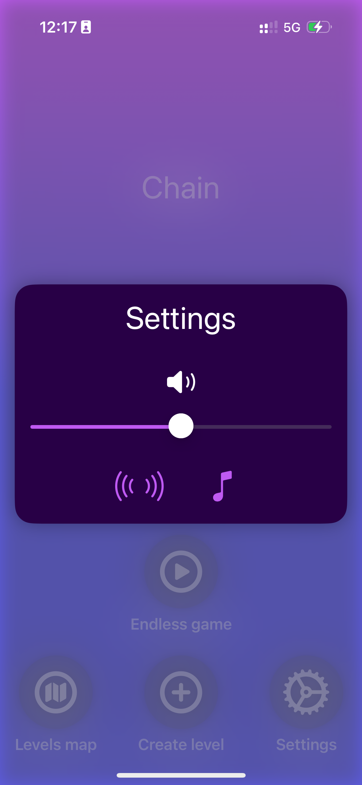

# SmallRotateGame

## Overview

**SmallRotateGame** is a dynamic, fast-paced game where players must rotate objects to fit into specific shapes or patterns. The game offers a combination of strategic thinking, quick reflexes, and fun gameplay mechanics, providing an engaging experience for players of all ages.

This project was created as a pet project to showcase skills in game development and can be used as a portfolio piece. The game features both pre-designed levels and procedurally generated levels, ensuring a mix of structured challenges and endless replayability.

## Key Features

- **Engaging Gameplay:** Rotate various objects to align them with target shapes, testing your precision and timing.
- **Dynamic Level Generation:** The game includes both pre-built levels and procedurally generated ones, keeping the gameplay fresh and challenging.
- **Simple Yet Addictive Mechanics:** Easy to understand but hard to master mechanics make the game accessible to casual players while offering depth for more dedicated gamers.
- **Intuitive Controls:** Control the rotation with simple input, making it easy for players to pick up and play.
- **Relaxing Soundtrack and haptic feedback:** Enjoy a calming soundtrack and tactile feedback that enhances the overall experience.
## Gameplay Mechanics

1. **Object Rotation:**
   Players are presented with a variety of objects that need to be rotated to fit into specific shapes or patterns. Precise alignment is key to progressing through the levels.

2. **Level System:**
   The game includes a mix of **pre-designed levels** with specific challenges and **procedurally generated levels**, which add randomness and variety to the gameplay.

3. **Score Tracking:**
   Points are awarded based on how accurately and quickly players align objects. High scores can be achieved by mastering both speed and precision.

4. **Level Creation:**
   Players can create their own levels using a simple level editor, allowing them to share their creations with others and expand the game’s content.

## Main Views

### 1. Main Menu
   The central hub of the game, allowing players to start a new game, view their scores, and access settings.
   

### 2. Gameplay View
   The primary view where players interact with rotating objects and try to align them within the given constraints.

   

### 3. Level's Map View
   The level map view allows players to select a level to play from a grid of available levels.
   
   
   

### 4. Level Complete Screen
   Displays the player’s score and options to move to the next level or replay the current one.
   
   

### 5. Settings View
   Allows players to adjust game settings such as sound, difficulty, and controls.
   
   

### 6. Level Editor
   A tool that allows players to create their own levels by placing objects and defining target shapes.
   
   

### 7. Infinite Game
   The game mode where the player can play levels infinitely. The levels are generated randomly. The difficulty can be chosen by the player.
   
   
   


## How to Play

1. Choose a level from the main menu.
2. Rotate objects using the controls to align them with the target shape.
3. Complete the level before the time runs out to proceed.
4. Aim for high scores by achieving perfect alignments in record time!

## Installation

1. Clone the repository:
   ```bash
   git clone https://github.com/queeeety/SmallRotateGame.git
   ```

2. Navigate to the project directory:
   ```bash
   cd SmallRotateGame
   ```

3. Build and run the game using your preferred IDE or game engine (Unity/Unreal).

## Future Improvements

- **Multiplayer Mode:** A competitive or cooperative multiplayer mode where players can race against each other or work together to complete levels.
- **Additional Themes:** Adding new visual themes and object designs to enhance variety.

## Disclaimer

This game was created as a personal project and is not intended for commercial use.
The main point was placed on UI and game logic. The game is optimized for mobile devices, but bugs may occur.

## License

This project is licensed under the MIT License.
